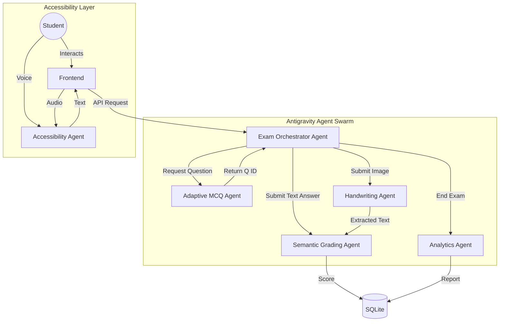

# AI-Driven Inclusive Assessment System: Antigravity Architecture

## 1. System Overview & Objective

**System Name:** Antigravity Inclusive Assessment Platform (AIAP)  
**Goal:** A fully open-source, offline-capable, AI-driven examination platform for inclusive education.  
**Core Framework:** Antigravity (Agentic Orchestration)  
**Target Users:** Students (including disabled), Teachers, Admins.

---

## 2. Antigravity Agent Architecture

The system is architected as a collection of specialized agents orchestrated to handle the exam lifecycle.

### The Agents

1.  **Exam Orchestrator Agent (The Boss)**
    *   **Role:** Manages the state of the exam, user sessions, and delegates tasks to other agents.
    *   **Responsibilities:** Start/Stop exams, enforce timers, trigger grading, aggregate results.
2.  **Semantic Grading Agent ( The Evaluator)**
    *   **Role:** AI grader for descriptive answers.
    *   **Engine:** Sentence-BERT (`all-MiniLM-L6-v2`).
    *   **Logic:** Computes cosine similarity between Student Answer and Model Answer.
3.  **Adaptive MCQ Agent (The Adjuster)**
    *   **Role:** Dynamic question selector.
    *   **Engine:** Rule-based Item Response Theory (IRT) estimation.
    *   **Logic:** Adjusts difficulty based on real-time performance.
4.  **Handwriting Processing Agent (The Visionary)**
    *   **Role:** Converts handwritten images to text.
    *   **Engine:** OpenCV (Preprocessing) + Tesseract OCR.
5.  **Accessibility Agent (The Bridge)**
    *   **Role:** Interface for Speech-to-Text and Text-to-Speech.
    *   **Engine:** Web Speech API (Browser-side) + Vosk (Server-side fallback).
6.  **Analytics Agent (The Analyst)**
    *   **Role:** Insight generator.
    *   **Engine:** Pandas + Plotly.

---

## 3. Agent Interaction Flow



---

## 4. Folder Structure

### Backend (Python/FastAPI)
```
/backend
│── /app
│   │── /agents                 # Antigravity Agents
│   │   │── __init__.py
│   │   │── orchestrator.py     # Main Logic
│   │   │── semantic_grader.py  # SBERT
│   │   │── adaptive_engine.py  # MCQ Logic
│   │   │── ocr_processor.py    # OpenCV/Tesseract
│   │   │── analytics.py        # Pandas
│   │── /api                    # REST API Routes
│   │   │── endpoints.py
│   │── /core                   # Config & Security
│   │── /db                     # Database Models
│   │── main.py                 # FastAPI Entry point
│── /data                       # Local storage for images/logs
│── requirements.txt
│── .env
```

### Frontend (React/Vite)
```
/frontend
│── /src
│   │── /assets
│   │── /components
│   │   │── /accessibility      # Voice controls
│   │   │── /exam               # Exam interface
│   │   │── /dashboard          # Analytics charts
│   │── /context                # State Management
│   │── /services               # API Calls
│   │── App.jsx
│── package.json
```

---

## 5. Database Schema (SQLite)

**Users**
*   `id` (PK), `username`, `role` (student/teacher/admin), `password_hash`

**Exams**
*   `id` (PK), `title`, `created_by` (FK), `is_active`, `settings` (JSON)

**Questions**
*   `id` (PK), `exam_id` (FK), `text`, `type` (mcq/text), `difficulty` (0.0-1.0), `model_answer`, `options` (JSON)

**Submissions**
*   `id` (PK), `user_id` (FK), `exam_id` (FK), `start_time`, `end_time`, `total_score`

**Answers**
*   `id` (PK), `submission_id` (FK), `question_id` (FK), `student_input` (text/image_path), `extracted_text` (if OCR), `score`, `feedback`

---

## 6. REST API Endpoints

*   `POST /auth/token` - Login
*   `POST /exam/start` - Initialize exam session
*   `POST /exam/next-question` - Orchestrator calls Adaptive Agent
*   `POST /exam/submit-answer` - Orchestrator calls Grader (or OCR -> Grader)
*   `POST /exam/finish` - Finalize and generate Analytics
*   `GET /dashboard/stats` - Fetch Analytics

---

## 7. Sample Python Code (The Agents)

### A. Semantic Grading Agent (SBERT)

```python
from sentence_transformers import SentenceTransformer, util

class SemanticGradingAgent:
    def __init__(self):
        # Load valid open-source model optimized for CPU
        self.model = SentenceTransformer('all-MiniLM-L6-v2')

    def grade_answer(self, student_answer: str, model_answer: str) -> dict:
        embeddings = self.model.encode([student_answer, model_answer])
        similarity = util.cos_sim(embeddings[0], embeddings[1]).item()
        
        # Grading Logic
        if similarity > 0.85:
            score = 100
        elif similarity > 0.65:
            score = 80
        elif similarity > 0.4:
            score = 40
        else:
            score = 0
            
        return {"score": score, "similarity": round(similarity, 2)}
```

### B. Adaptive MCQ Agent

```python
import random

class AdaptiveMCQAgent:
    def get_next_question(self, available_questions, current_performance):
        """
        available_questions: List of Question objects
        current_performance: float (0.0 to 1.0) - average correctness so far
        """
        # Target difficulty matches current performance (Zone of Proximal Development)
        target_diff = current_performance 
        
        # Find question closest to target difficulty
        best_match = min(available_questions, key=lambda q: abs(q.difficulty - target_diff))
        return best_match

    def update_performance(self, current_theta, is_correct):
        # Simple update rule
        learning_rate = 0.1
        if is_correct:
            return min(1.0, current_theta + learning_rate)
        else:
            return max(0.1, current_theta - learning_rate)
```

### C. Handwriting Processing Agent (OCR)

```python
import cv2
import pytesseract
import numpy as np

# Configure tesseract path for Windows
# pytesseract.pytesseract.tesseract_cmd = r'C:\Program Files\Tesseract-OCR\tesseract.exe'

class HandwritingAgent:
    def extract_text(self, image_bytes):
        # decode image
        nparr = np.frombuffer(image_bytes, np.uint8)
        img = cv2.imdecode(nparr, cv2.IMREAD_GRAYSCALE)
        
        # Preprocessing
        img = cv2.threshold(img, 0, 255, cv2.THRESH_BINARY + cv2.THRESH_OTSU)[1]
        
        # OCR
        text = pytesseract.image_to_string(img)
        return text.strip()
```

---

## 8. Accessibility Workflow

1.  **Blind User**:
    *   **Input**: Presses `Space` to activate microphone. Speaks answer.
    *   **Process**: Browser `SpeechRecognition` API converts to text -> Sent to Backend.
    *   **Output**: Backend sends next question text.
    *   **Feedback**: Browser `speechSynthesis` reads the question aloud automatically.

2.  **Motor Impaired**:
    *   **Navigation**: `Tab` / `Shift+Tab` to move. `Enter` to select. Large click targets.

---

## 9. Deployment (100% Free)

*   **Frontend**: Hosted on Vercel or Netlify (Free Tier).
*   **Backend + Database**: 
    *   **Option A**: Run locally on a laptop (localhost) for demo/research.
    *   **Option B**: Render.com Free Tier (Web Service for Python).
    *   **Database**: SQLite file stored in persistent disk (Render offers paid, so use **Neon (PostgreSQL)** free tier if going cloud, or just SQLite for local).
    *   **Models**: `all-MiniLM-L6-v2` runs on 500MB RAM, fits in free tier instances.

---

## 10. Limitations & Future Scope

**Limitations:**
1.  **SBERT Context**: Cannot understand complex logic or math proofs, only semantic similarity.
2.  **OCR Handwriting**: Very dependent on clear handwriting.
3.  **Local Resources**: Running OCR + SBERT concurrently requires at least 2GB RAM.

**Future Scope:**
1.  **Multilingual**: Use `paraphrase-multilingual-MiniLM-L12-v2`.
2.  **Proctoring**: Add webcam gaze tracking (OpenCV) to detect cheating.
